MiniSkybot Robot V1.0
===============
**Please note: This thing is part of a list that was [automatically generated](https://github.com/carlosgs/export-things) and may have been updated since then. Make sure to check for the current license and authorship.**  

MiniSkybot Robot V1.0  by obijuan , published Apr 23, 2011

Description
--------
The MiniSkybot is a new mobile robot aimed for educational purposes. It has three new important features: 3D-printable, fully open-source (mechanics + electronics) and designed exclusively with Open source tools (OpenScad, Freecad and Kicad)   
 
This robotic platform allows the students not only to learn robot programming, but also to modify easily the chassis and create new custom parts. Being open source the robot can be freely modified, copied, and shared across the Internet. In addition, it is extremely cheap, being the cost almost exclusively determined by the cost of the servos, electronics and sensors.   
 
This work is being done between three professors from the Robotics Lab at Carlos III University of Madrid and one part-time teacher at Universidad Autonoma the Madrid:   
 
* Dr. Juan Gonzalez-Gomez (UC3M)   
* Andres Prieto-Moreno (UAM)   
* Dr. Alberto Valero (UC3M)   
* Dr. Mohammed Abderrahim (UC3M)   
 
Also, there are serveral engineering students involved.   
 
The robot chassis has been design with Openscad. More information can be found on this link: <a href="http://www.iearobotics.com/wiki/index.php?title=Mini-Skybot_v1.0" target="_blank" rel="nofollow">iearobotics.com/wiki/index.php?title=Mini-Skybot_v1.0</a>  
 
The electronics consist of the open-source hardware Skycube board (http://www.iearobotics.com/wiki/index.php?title=Skycube), a small board with an PIC16F876A micro-controller designed with the open-source Kicad EDA tool.   
 
The following things previously designed and uploaded to thingiverse have been used:   
 
* Servo wheels: <a href="http://www.thingiverse.com/thing:4767" target="_blank" rel="nofollow">thingiverse.com/thing:4767</a>  
* Parameterized battery pack: <a href="http://www.thingiverse.com/thing:5079" target="_blank" rel="nofollow">thingiverse.com/thing:5079</a>  
 
The Chassis is an evolution of the proof of concept minimal chassis:   
 
<a href="http://www.thingiverse.com/thing:4954" target="_blank" rel="nofollow">thingiverse.com/thing:4954</a>  
 
We want to thank to all our students who are testing and improving this robot. Special thanks to Olalla Bravo ( <a href="http://www.thingiverse.com/Olalla" target="_blank" rel="nofollow">thingiverse.com/Olalla</a> ) for the design of the Castor wheel.   
 
This preliminary work will be presented soon at the 6th International Symposium on Autonomous Minirobots for Research and Edutainment ( <a href="http://www.amiresymposia.org/amire2011/" target="_blank" rel="nofollow">amiresymposia.org/amire2011/</a> )   
 
**UPDATE 2011/May/28**   
The paper and slides about the MiniSkybot, presented at the Amire 2011 conference can be found at <a href="http://www.iearobotics.com/wiki/index.php?title=Paper:2011-Amire-Miniskybot" target="_blank" rel="nofollow">iearobotics.com/wiki/index.php?title=Paper:2011-Amire-Miniskybot</a>  
 
<b>Video</b>: <a href="http://www.youtube.com/watch?v=RSO1v0a-HO8" target="_blank" rel="nofollow">youtube.com/watch?v=RSO1v0a-HO8</a>  
 
**UPDATE 2011/Jun/23**   
A new video of CW Kreimer explaining and showing his Miniskybot: <a href="http://www.youtube.com/watch?v=2EqvuPXYKf0" target="_blank" rel="nofollow">youtube.com/watch?v=2EqvuPXYKf0</a>  
 
**UPDATE 2011/Dec/05**   
The new skymega board (Arduino compatible) is now being using for controlling the robot:  <a href="http://www.thingiverse.com/thing:14197" target="_blank" rel="nofollow">thingiverse.com/thing:14197</a>  
 
**UPDATE 2013/March/18**    
New Miniskybot 2: <a href="http://www.thingiverse.com/thing:63165" target="_blank" rel="nofollow">thingiverse.com/thing:63165</a>  

Instructions
--------
The robot assembly is easy. More detailed instrucctions can be found on this link: 
 
<a href="http://www.iearobotics.com/wiki/index.php?title=Mini-Skybot_v1.0" target="_blank" rel="nofollow">iearobotics.com/wiki/index.php?title=Mini-Skybot_v1.0</a> 
 
 Even though the instructions are written in Spanish, there are a lot of pictures (I will translate into English in the future) 
 
The steps are the following: 
 
1) Print all the parts: 
  - 1x front part 
  - 1x rear part 
  - 1x battery pack holder 
  - 1x battery pack 
  - 1x Castor wheel part 1 
  - 1x Castor wheel part 2 
  - 1x Castor wheel part 3 
  - 2x Servo wheels 
 
2) Mount the servo wheels ( <a href="http://www.thingiverse.com/thing:4767" target="_blank" rel="nofollow">thingiverse.com/thing:4767</a> ) 
3) Mount the battery pack ( <a href="http://www.thingiverse.com/thing:5079" target="_blank" rel="nofollow">thingiverse.com/thing:5079</a> ) 
4) Hack the servos (so that they can turn 360 degrees) 
4-bis) Attach the front and rear parts to the servos 
5) Mount and attach the castor wheel 
6) Screw the spacers and the electronics 
7) Insert the battery pack  
8) Connect everything 
9) The robot is ready for programming! 
 

Files
--------

 [ Miniskybot-castor-wheel-p2.stl](Miniskybot-castor-wheel-p2.stl)  

 [ battery-pack-4-AAA.stl](battery-pack-4-AAA.stl)  

 [ Miniskybot-v1.0-Chassis-SRC.zip](Miniskybot-v1.0-Chassis-SRC.zip)  

 [ Mini-skybot-battery-holder.stl](Mini-skybot-battery-holder.stl)  

 [ Mini-skybot-U-front-skycube-ultrasound.stl](Mini-skybot-U-front-skycube-ultrasound.stl)  

 [ Miniskybot-servo_wheel-skybot.stl](Miniskybot-servo_wheel-skybot.stl)  

 [ Miniskybot-castor-wheel-p1.stl](Miniskybot-castor-wheel-p1.stl)  

 [ Miniskybot-U-rear-skycube-rounded-short.stl](Miniskybot-U-rear-skycube-rounded-short.stl)  

 [ Miniskybot-castor-wheel-p3.stl](Miniskybot-castor-wheel-p3.stl)  

Pictures
--------
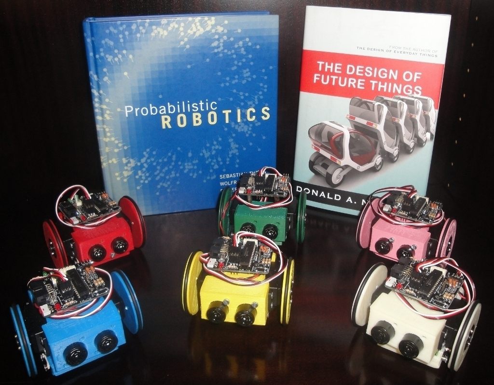
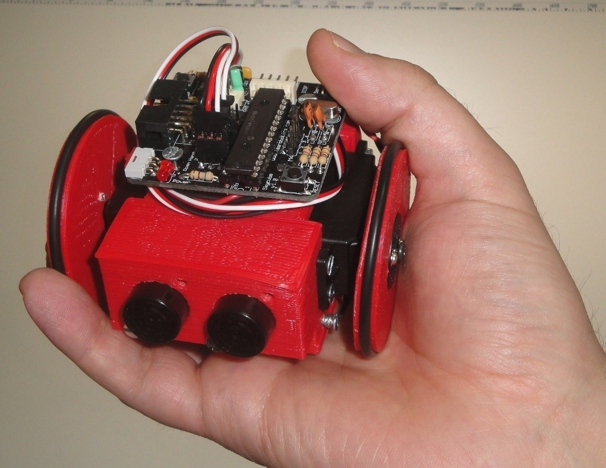
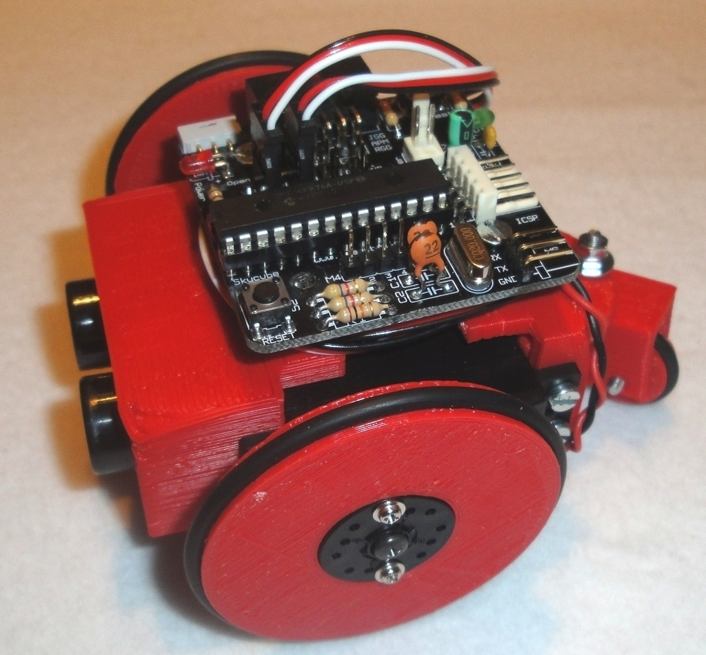
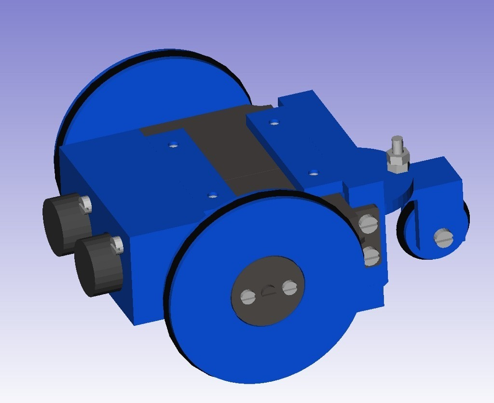
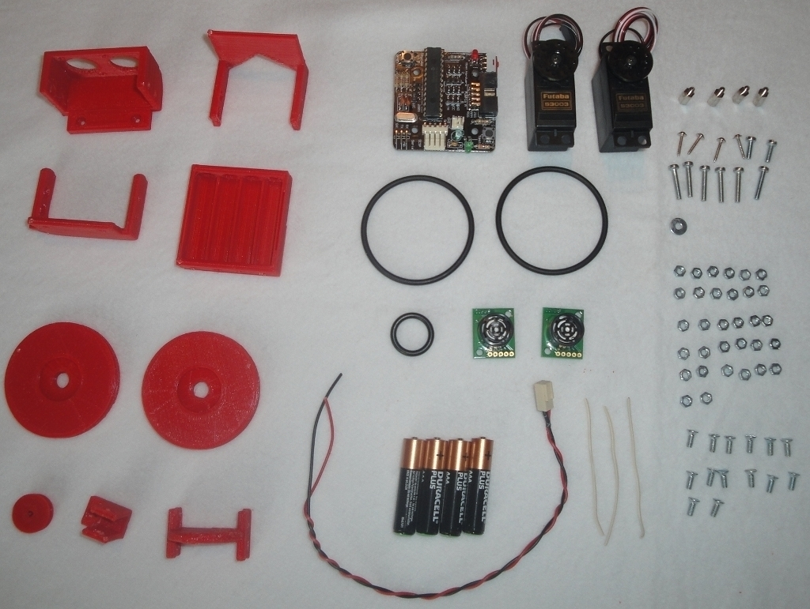
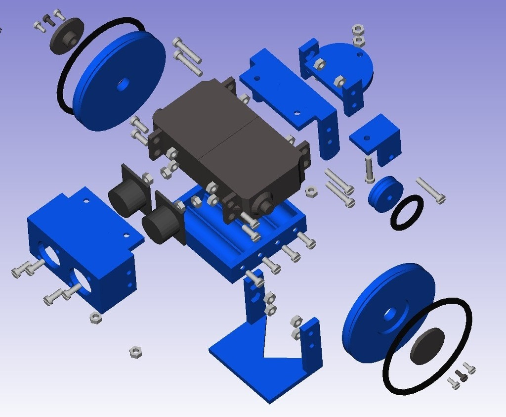
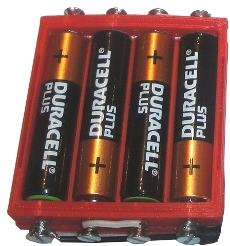

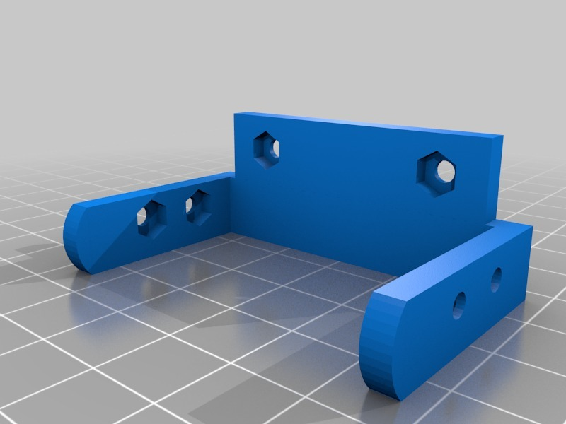
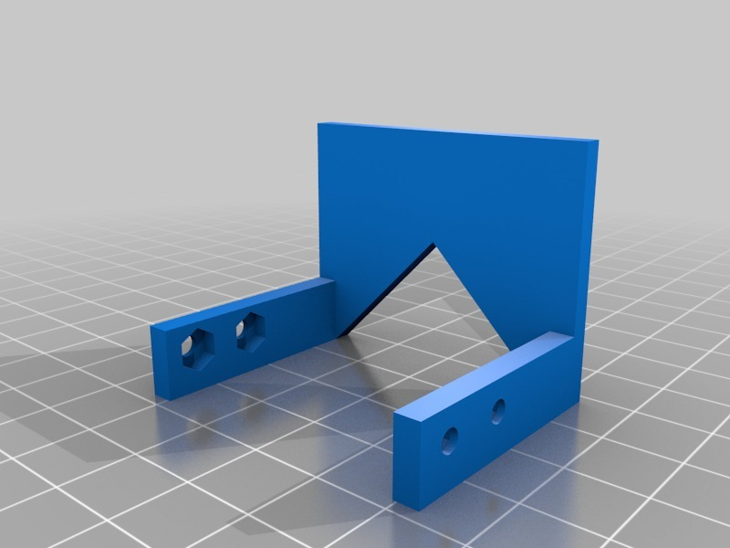
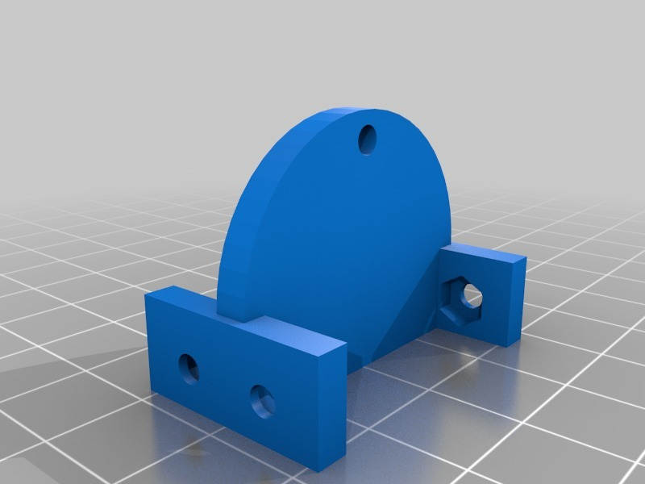
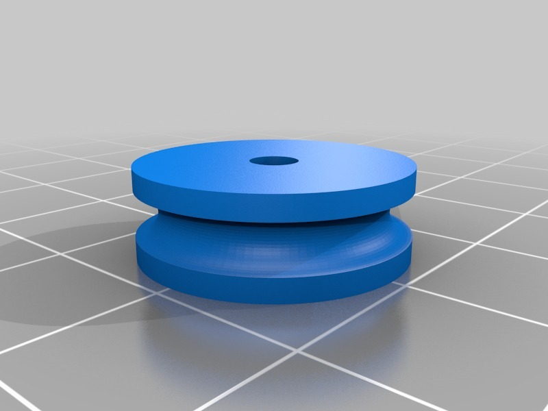
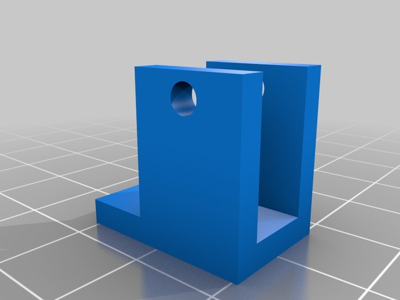
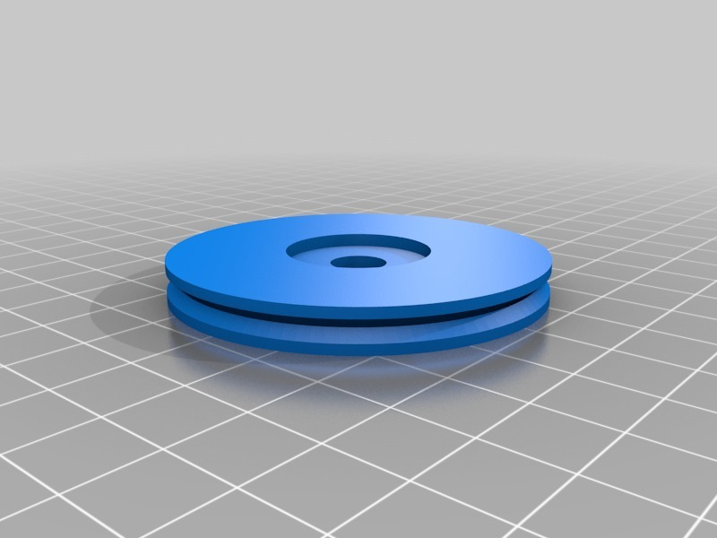
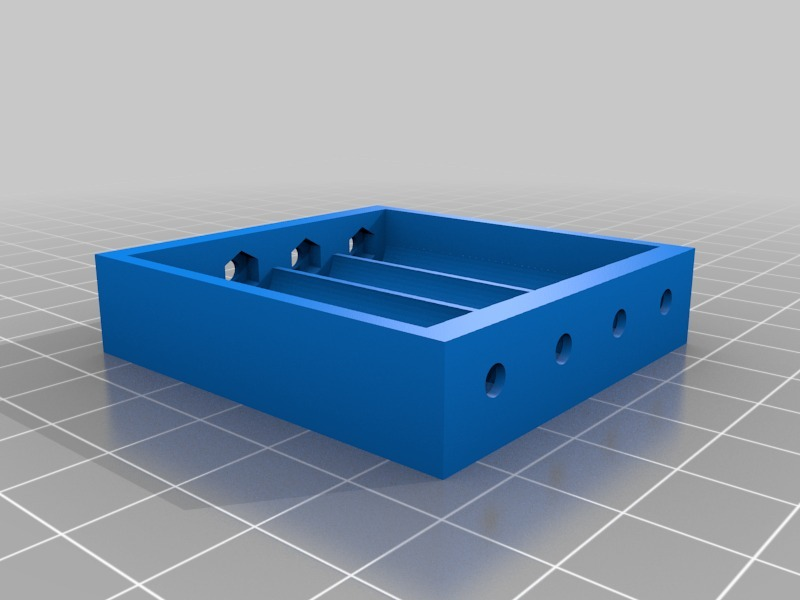
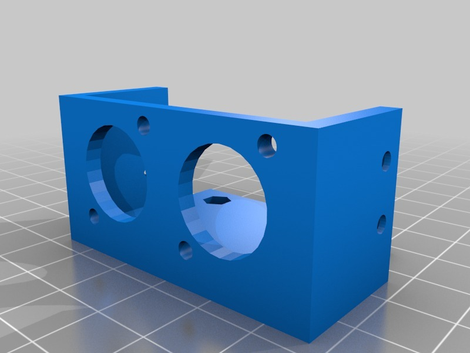

Tags
--------
educational , makerbot , Miniskybot , Mobile robot , openscad , Plastic Valley , printbot , robot , robotics , servo , skymega , UC3M  

  

License
--------
MiniSkybot Robot V1.0 by obijuan is licensed under the Creative Commons - Attribution - Share Alike license.  

By: Juan Gonzalez-Gomez (Obijuan)
--------
<http://www.iearobotics.com/wiki/index.php?title=Juan_Gonzalez:Main>